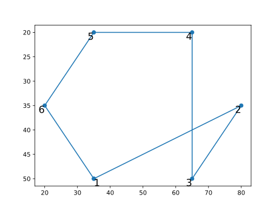

# GeoPoly


## User guide

**GeoPoly** *is a Julia utility contained in the package* [`MagGravPoly`](index.md#maggravpoly) *and developed for handling polygonal shapes in the framework of 2D to 2.75D potential-fields forward and inverse modeling*. 


### Tutorial

#### Check the orientation of a polygon
First load the module and define a list of vertices of the poligonal bodies 
and the relative indices mapping each body to its vertices:
```@example ex1
using MagGravPoly.GeoPoly
# vertices of the poligonal bodies
vertices  = [35.0 50.0;
             65.0 50.0;
             80.0 35.0;
             65.0 20.0;
             35.0 20.0;
             20.0 35.0]
			 
# indices of vertices for the body
ind1 = collect(1:6)
bodyindices = [ind1]
# construct the poligonal body object
pbody = PolygBodies2D(bodyindices,vertices)
nothing # hide
```
and then checks if the polygon is defined in a clockwise or counter-clockwise order: 
```@example ex1
# check about the order
for i=1:pbody.nbo
aclk = checkanticlockwiseorder(pbody.bo[i])
@show aclk
end
```

In fact plotting the polygon:

    using PyPlot
    figure()
	for i=1:length(bodyindices)
	x = copy(pbody.bo[i].ver1[:,1])
	y = copy(pbody.bo[i].ver1[:,2])
	append!(x,pbody.bo[i].ver1[1,1])
	append!(y,pbody.bo[i].ver1[1,2])
    p=PyPlot.plot(x,y,"-o")
    for i=1:length(x)-1
	s=string(i)
	if i<=1
	txtalign = "left"
	else
	txtalign = "right"
    end
    text(x[i],y[i],s=s,horizontalalignment=txtalign,
    fontsize=16,verticalalignment="top")
	end
    end
    gca().invert_yaxis()

is easy to see that is counter-clockwise oriented.


#### Check and fixing for crossing polygon sides
First load the module and define a list of vertices of the poligonal bodies 
and the relative indices mapping each body to its vertices:
```@example ex2
using MagGravPoly.GeoPoly
# vertices of the poligonal bodies
vertices  = [35.0 50.0;
             80.0 35.0;
             65.0 50.0;
             65.0 20.0;
             35.0 20.0;
             20.0 35.0]
			 
# indices of vertices for the body
ind1 = collect(1:6)
bodyindices = [ind1]
# construct the poligonal body object
pbody = PolygBodies2D(bodyindices,vertices)
nothing # hide
```

Now checks for any crossing polygon side:

```@example ex2
chk = checkpoly(pbody.bo)
@show chk[1]
```

In fact plotting the polygon:

	using PyPlot
    figure()
	for i=1:length(bodyindices)
	x = copy(pbody.bo[i].ver1[:,1])
	y = copy(pbody.bo[i].ver1[:,2])
	append!(x,pbody.bo[i].ver1[1,1])
	append!(y,pbody.bo[i].ver1[1,2])
    p=PyPlot.plot(x,y,"-o")
    for i=1:length(x)-1
	s=string(i)
	if i<=1
	txtalign = "left"
	else
	txtalign = "right"
    end
    text(x[i],y[i],s=s,horizontalalignment=txtalign,
    fontsize=16,verticalalignment="top")
	end
    end
    gca().invert_yaxis()
	


We can try to fix the polygonal geometries using the `verpolyshift!` function:

```@example ex2
# polygon fixing
GeoPoly.verpolyshift!(pbody.bo)
```

and the results will be the following:


## Public API
```@docs
MagGravPoly.GeoPoly
```

### Data structures
```@docs
MagGravPoly.GeoPoly.BodySegments2D
MagGravPoly.GeoPoly.PolygBodies2D
```

!!! warning 
    Vertices of the polygonal bodies must be provided 
    counterclockwise to the structure `BodySegments2D`
    to perform gravity & magnetic anomaly calculations using the
    functions in the packages `MagGravPoly`.
	To assess this use the function `checkanticlockwiseorder`.


```@docs
MagGravPoly.GeoPoly.TopoEdges
```

### Checking-geometries functions
#### Single polygonal body
```@docs
MagGravPoly.GeoPoly.intersectpairpoly
MagGravPoly.GeoPoly.selfintersectpoly
MagGravPoly.GeoPoly.checkall
MagGravPoly.GeoPoly.checkanticlockwiseorder
```

#### Multiple polygonal bodies
```@docs
MagGravPoly.GeoPoly.checktopo
MagGravPoly.GeoPoly.checkpoly
```

#### Fixing-geometries functions
```@docs
MagGravPoly.GeoPoly.verpolyshift!
MagGravPoly.GeoPoly.verpolyallshift!
MagGravPoly.GeoPoly.vertoposhift!
MagGravPoly.GeoPoly.fixall!
```

### Useful functions
```@docs
MagGravPoly.GeoPoly.checkbodyindices
MagGravPoly.GeoPoly.Inter2Segm
MagGravPoly.GeoPoly.isInternal
MagGravPoly.GeoPoly.checkmodelizdim
MagGravPoly.GeoPoly.calcareapoly
MagGravPoly.GeoPoly.calcareamanypoly
```
